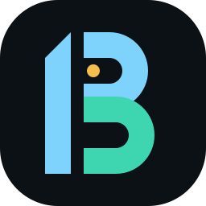

<p align="center">
  <a href="../../README.md"></a>
</p>

<p align="center"><a href="../../README.md">Dep Beacon</a></p>

<h1 align="center">Zed extension</h1>

<p align="center">
  <a href="../../README.md">Project overview</a> ·
  <a href="#resources">Resources</a>
</p>

<details>
<summary>On this page</summary>

- [Required version](#required-version)
- [Development](#development)
- [Install as a development extension](#install-as-a-development-extension)
- [Zed UI](#zed-ui)
- [Settings](#settings)
- [Publishing](#publishing)
- [License](#license)
- [Resources](#resources)

</details>

This directory contains the thin Rust/WASM adapter that connects Zed to `@santi020k/dep-beacon-lsp`. The language server provides dependency status hints, an actionable diagnostics dashboard, npm links, update quick fixes, pnpm catalog awareness, and OSV vulnerability signals.

The Node language-server source and npm package are maintained separately in [`packages/dep-beacon-lsp`](../../packages/dep-beacon-lsp).

## Required version

The zero-configuration dependency workflow requires both the Zed extension and `@santi020k/dep-beacon-lsp` `0.0.3` or newer. The adapter normally installs the matching latest language-server package automatically.

Version `0.0.3` is the first release with:

- default-visible update and security diagnostics;
- individual and manifest-wide update actions;
- optional inline status hints;
- clear handling when a range resolves beyond npm's `latest` tag;
- suppression of no-op and unrelated update actions.

## Development

From the repository root, build and validate the language server:

```sh
pnpm --filter @santi020k/dep-beacon-core build
pnpm --filter @santi020k/dep-beacon-lsp build
pnpm --filter @santi020k/dep-beacon-lsp typecheck
pnpm --filter @santi020k/dep-beacon-lsp test
pnpm --filter @santi020k/dep-beacon-lsp validate:extension
```

Compile the adapter directly with:

```sh
cargo check \
  --manifest-path extensions/dep-beacon-lsp/Cargo.toml \
  --target wasm32-wasip1
```

## Install as a development extension

1. Install Rust with `rustup` and add the `wasm32-wasip1` target.
2. Build the language server with the commands above.
3. Run `zed: install dev extension` and select `extensions/dep-beacon-lsp`.

The adapter defaults to Zed's managed `@santi020k/dep-beacon-lsp` installation so a
stale global binary cannot override the released server. To test an unpublished local
build, configure an explicit command in Zed's project or user settings:

```json
{
  "lsp": {
    "dep-beacon": {
      "binary": {
        "path": "/absolute/path/to/node",
        "arguments": ["/absolute/path/to/dep-beacon/packages/dep-beacon-lsp/dist/server.cjs", "--stdio"]
      }
    }
  }
}
```

Run `editor: restart language server` after changing the command. Remove the explicit
binary configuration to return to the managed released server. Publish the language-server
package before releasing an adapter that depends on new server behavior.

## Zed UI

No Zed settings are required. Open `package.json` or `pnpm-workspace.yaml` and Dep Beacon automatically reports:

- available updates as warnings;
- critical and high security issues as errors;
- other security issues as warnings;
- invalid ranges and missing packages as errors.

Click Zed's error and warning indicator or run `diagnostics: deploy` (`cmd-shift-m` on macOS, `ctrl-shift-m` on Linux and Windows) to open the dependency dashboard. It collects actionable dependencies from open manifests in one editable multi-buffer.

Place the cursor on an actionable dependency and use `cmd-.` on macOS (`ctrl-.` on Linux and Windows) to:

- apply its patch, minor, major, or latest update;
- update every compatible dependency in the manifest;
- update every dependency in the manifest to latest.

Bulk actions appear only when the selected dependency has an applicable manifest edit. “Compatible” selects the highest patch or minor target without crossing a major version; “latest” may include breaking major updates.

For `catalog:` and named `catalog:<name>` references, actions update the owning entry in `pnpm-workspace.yaml` rather than replacing the reference in `package.json`.

Hover a dependency to see the highest version accepted by its range, npm's `latest` tag, available targets, and security details.

If npm publishes a newer version under another tag such as `next`, the existing range may already accept it while npm's `latest` tag remains older. Dep Beacon explains that state and does not offer a no-op edit or downgrade.

### After installing or updating

Zed normally starts Dep Beacon when a supported manifest opens. If the manifest was already open while installing, updating, or rebuilding the extension, focus that file and run `editor: restart language server` once. Closing and reopening the manifest also attaches the new server version.

### Optional inline status

The default experience does not need inline hints or CodeLens. Users who prefer a status beside every dependency can enable Zed's inlay hints:

```json
{
  "inlay_hints": {
    "enabled": true,
    "show_other_hints": true
  }
}
```

Hints use short signals such as `↑ 18.3.1 → 19.1.0`, `⚠ high risk`, and `✓ 19.1.0`.

## Settings

Configure the server under Zed's `lsp.dep-beacon.settings` key:

```json
{
  "lsp": {
    "dep-beacon": {
      "settings": {
        "checkVulnerabilities": true,
        "includePrerelease": false,
        "registryUrl": "https://registry.npmjs.org",
        "showUpdateDiagnostics": true
      }
    }
  }
}
```

`checkVulnerabilities` defaults to `true`, `includePrerelease` defaults to `false`, `registryUrl` defaults to the public npm registry, and `showUpdateDiagnostics` defaults to `true`.

Set `showUpdateDiagnostics` to `false` if you do not want every available dependency update to appear as a Zed warning:

```json
{
  "lsp": {
    "dep-beacon": {
      "settings": {
        "showUpdateDiagnostics": false
      }
    }
  }
}
```

This hides only update warnings. Security findings, invalid ranges, and missing packages remain visible, while dependency hovers and all individual and bulk update actions continue to work.

## Publishing

The npm language server is published as `@santi020k/dep-beacon-lsp`. The Zed registry points its `dep-beacon-lsp` entry at `extensions/dep-beacon-lsp` in this repository.

For `0.0.3`, publish `@santi020k/dep-beacon-lsp@0.0.3` first, confirm that npm's `latest` tag resolves to it, and then update the Zed extension registry. Publishing the adapter first can leave users temporarily running the older language server without the documented workflow.

The same registry environment used by `santi020k-theme` can be reused:

- Secret `ZED_EXTENSIONS_TOKEN`
- Variable `ZED_EXTENSIONS_FORK`
- Optional variable `ZED_EXTENSIONS_HEAD`

## License

MIT

## Resources

[Project overview](../../README.md) · [License](../../LICENSE)
