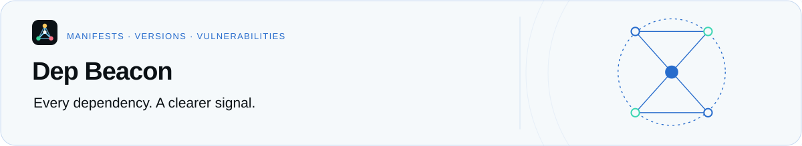

<p align="center">
  <a href="../../README.md">
    <picture>
      <source media="(prefers-color-scheme: dark)" srcset="../../docs/assets/readme/workspace-dark.svg">
      
    </picture>
  </a>
</p>

<h1 align="center">Language server</h1>

<p align="center">
  <a href="https://www.npmjs.com/package/@santi020k/dep-beacon-lsp"></a>
  <a href="../../LICENSE"></a>
</p>

<p align="center">
  <a href="https://github.com/santi020k/dep-beacon/blob/main/README.md">Project overview</a> ·
  <a href="https://github.com/santi020k/dep-beacon/blob/main/packages/dep-beacon-lsp/package.json">Package manifest</a> ·
  <a href="https://github.com/santi020k/dep-beacon/blob/main/packages/dep-beacon-lsp/CHANGELOG.md">Changelog</a> ·
  <a href="#resources">Resources</a>
</p>

<details>
<summary>On this page</summary>

- [Features](#features)
- [Usage](#usage)
- [Settings](#settings)
- [Development](#development)
- [Related extension](#related-extension)
- [License](#license)
- [Resources](#resources)

</details>

`@santi020k/dep-beacon-lsp` provides dependency intelligence over the Language Server Protocol. It powers the Dep Beacon extension for Zed and reuses `@santi020k/dep-beacon-core` for manifest analysis, npm metadata, pnpm workspace catalogs, and OSV vulnerability checks.

Dep Beacon for Zed `0.0.3` requires language server `0.0.3` or newer. The Zed adapter installs it automatically unless an explicit `lsp.dep-beacon.binary` command is configured.

## Features

- `package.json`, `pnpm-workspace.yaml`, and `pnpm-workspace.yml` support.
- Compact dependency status inlay hints and CodeLens.
- Actionable project diagnostics for updates and security issues.
- Quick fixes for patch, minor, major, and latest updates.
- Bulk actions for compatible updates and latest versions.
- npm document links.
- Default and named pnpm catalog resolution.
- Optional OSV.dev vulnerability checks.

## Usage

The package exposes the `dep-beacon-lsp` executable. LSP clients should launch it over standard input and output:

```sh
dep-beacon-lsp --stdio
```

Zed users do not need to install this package manually. The Zed adapter installs it through Zed's managed npm APIs by default.
For a local development build, configure an explicit `lsp.dep-beacon.binary` command
as described in the [adapter development guide](../../extensions/dep-beacon-lsp/README.md).

In Zed, the server publishes default-visible diagnostics for dependency updates, invalid ranges, missing packages, and OSV findings. It also provides:

- hover details for range resolution, npm tags, targets, and security findings;
- per-dependency patch, minor, major, and latest edits;
- manifest-wide compatible and latest edits;
- catalog-aware workspace edits that update `pnpm-workspace.yaml`;
- optional compact inlay hints.

No action is returned when the selected dependency already has the correct manifest range. This includes packages whose range accepts a version published under `next` while npm's `latest` tag is older.

## Settings

LSP clients can send these values under `depBeacon`:

- `checkVulnerabilities` enables OSV.dev checks and defaults to `true`.
- `includePrerelease` includes prerelease versions and defaults to `false`.
- `registryUrl` selects the npm-compatible registry and defaults to `https://registry.npmjs.org`.
- `showUpdateDiagnostics` publishes available updates as warnings and defaults to `true`.

Set `showUpdateDiagnostics` to `false` to keep update details and code actions available without adding a warning for every outdated dependency. Security findings, invalid ranges, and missing packages continue to publish diagnostics.

## Development

From the repository root:

```sh
pnpm --filter @santi020k/dep-beacon-core build
pnpm --filter @santi020k/dep-beacon-lsp build
pnpm --filter @santi020k/dep-beacon-lsp typecheck
pnpm --filter @santi020k/dep-beacon-lsp test
pnpm --filter @santi020k/dep-beacon-lsp validate:extension
```

The TypeScript server is implemented in `src/server.ts` and bundled to `dist/server.cjs` for publication.

## Related extension

The Rust/WASM Zed adapter is maintained separately in [`extensions/dep-beacon-lsp`](../../extensions/dep-beacon-lsp).

## License

MIT

## Resources

[Project overview](https://github.com/santi020k/dep-beacon/blob/main/README.md) · [License](https://github.com/santi020k/dep-beacon/blob/main/LICENSE)
