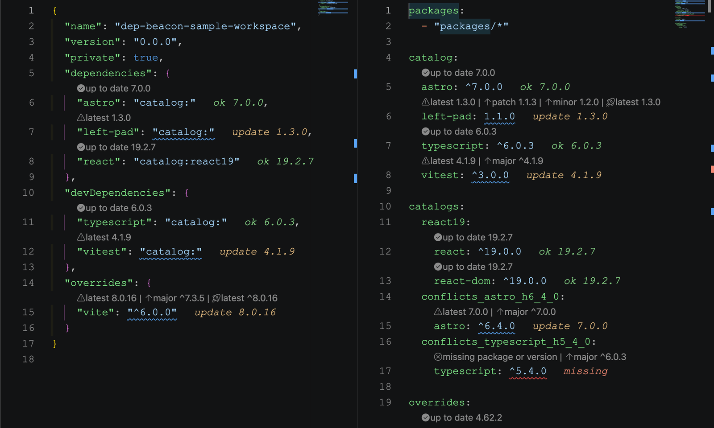

# Dep Beacon

Dep Beacon adds dependency version and security signals to npm manifests in VS Code.

Open `package.json`, `pnpm-workspace.yaml`, or `pnpm-workspace.yml` and the extension highlights dependency ranges with inline status, diagnostics, and CodeLens update actions.

## What You Get

- CodeLens actions for next patch, next minor, next major, and latest dependency updates.
- Colored inline status for up-to-date, outdated, vulnerable, invalid, and missing ranges.
- Diagnostics for unpublished versions, missing packages, outdated ranges, and OSV vulnerabilities.
- pnpm workspace catalog support for default and named catalogs.
- Support for npm overrides, Yarn resolutions, pnpm overrides, and pnpm package extensions.
- Commands for sorting manifests, clearing cache, toggling prerelease versions, opening package pages, and starting dependency installs.

## Supported Files

- `package.json`: dependency sections, overrides, resolutions, and pnpm override blocks.
- `pnpm-workspace.yaml` / `pnpm-workspace.yml`: catalogs, overrides, and package extensions.

## Status Colors

- Green means the declared range already accepts the latest stable version.
- Yellow means a newer version is available.
- Orange means OSV reports low or moderate vulnerability risk.
- Red means the package or version is invalid, missing from npm, or has high or critical vulnerability risk.

## Update Actions

- `patch`: move to the newest patch in the current minor.
- `minor`: move to the nearest newer minor in the current major.
- `major`: move to the nearest newer major.
- `latest`: move to npm's latest dist-tag or newest stable version.

Dep Beacon preserves common range prefixes like `^` and `~` when it applies an update.

## Commands

- `Dep Beacon: Refresh Dependency Signals`
- `Dep Beacon: Clear Registry Cache`
- `Dep Beacon: Toggle Prerelease Versions`
- `Dep Beacon: Sort Current Manifest`
- `Dep Beacon: Run Package Install`
- `Dep Beacon: Open Documentation`
- `Dep Beacon: Show Debug Output`

Manual refreshes also write activation, scheduling, cache, parse, analysis, and diagnostic details to the `Dep Beacon` output channel.

## Settings

- `depBeacon.enable`: enable or disable Dep Beacon.
- `depBeacon.includePrerelease`: include prerelease versions in update targets.
- `depBeacon.checkVulnerabilities`: query OSV.dev for vulnerability summaries.
- `depBeacon.registryUrl`: use a custom npm-compatible registry.
- `depBeacon.cacheTtlMinutes`: control registry cache duration.
- `depBeacon.showInlineStatus`: show or hide inline status labels.
- `depBeacon.runInstallOnSave`: start dependency installs after supported manifest saves.
- `depBeacon.packageManager`: choose `auto`, `npm`, `pnpm`, or `yarn`.

## Privacy

When vulnerability checks are enabled, Dep Beacon sends package names and resolved versions to OSV.dev. Turn off `depBeacon.checkVulnerabilities` if you are offline or do not want dependency names checked against an external vulnerability service.
